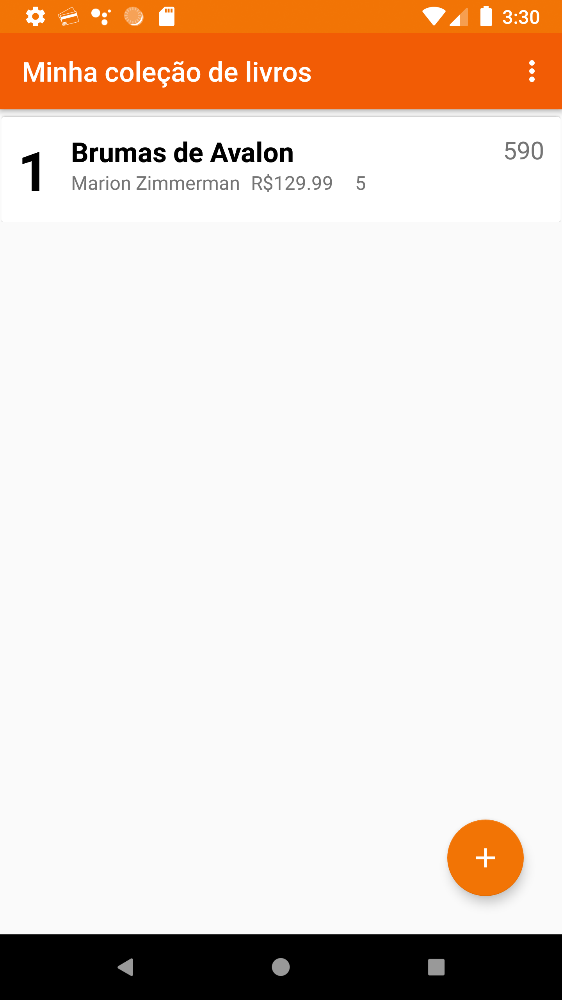
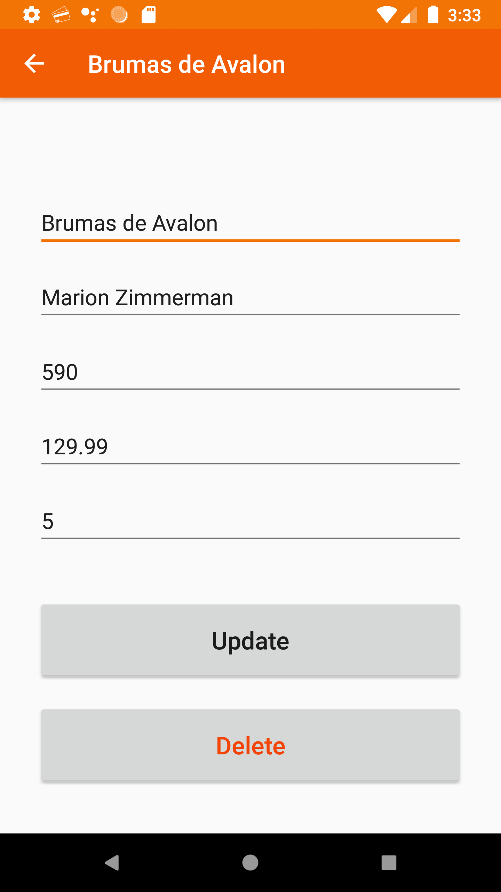
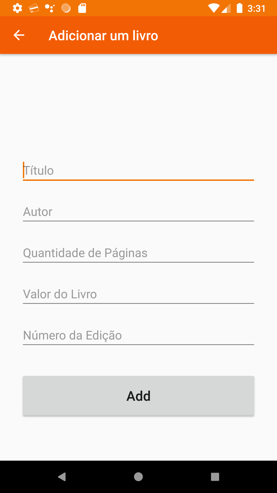

<h1 align="center">Pinguino</h1>
<h3 align="center">O seu gerenciador de livros</h2>

  
  

  

O seu próprio gerenciador de livros, saiba quantos livros você tem, quanto pagou por eles, a quantidade de páginas, e muito mais. Edite, delete e faça o que mais tiver vontade!
Adicione

---

## Screenshots

 &nbsp;  &nbsp;
 &nbsp;
 &nbsp;

---

Feito com ♥ por <a href="https://twitter.com/Dadarkp3">Dadarkp3</a> | Salvador 2021.
